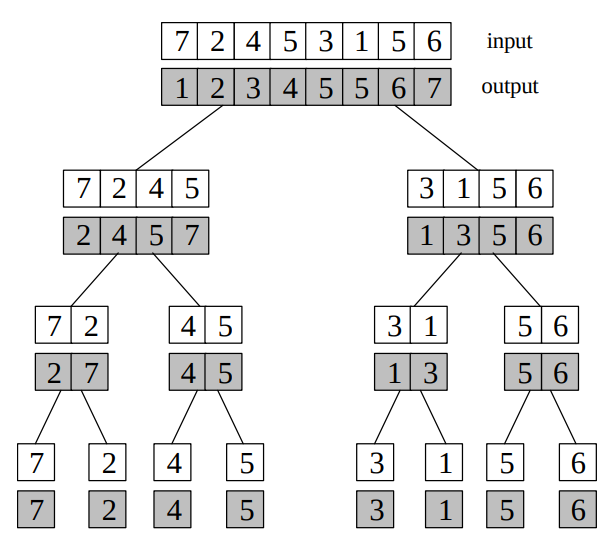
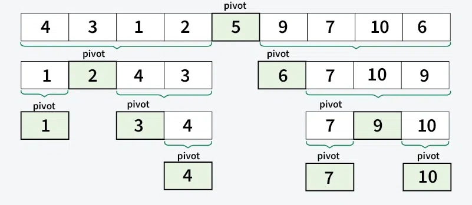
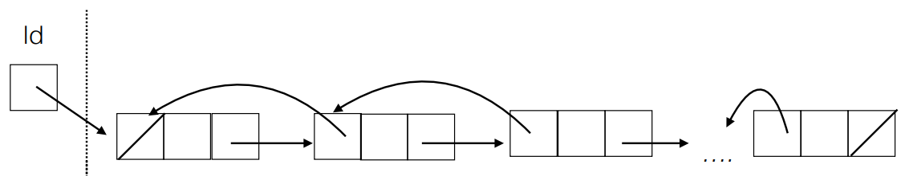

# L1 - intro
Un algoritmo è un procedimento che risolve un determinato problema attraverso un numero finito di passi elementari.

Una struttura dati è una particolare organizzazione delle informazioni.

L'efficienza di un algoritmo è spesso legata al modo in cui i dati sono strutturati.
Se so che farò tanti inserimenti sceglierò una struttura dati appropriata.

> Tempo di esecuzione di un algoritmo = somma dei costi x frequenza di ogni operazione 
> — Donald Knuth

Non tutti i problemi "formalizzabili" sono risolvibili con un algoritmo, *e.g.: halting problem*.

### Programma del corso
- Ripasso di programmazione
- Ripasso di analisi e matematica di base
- Algoritmi di ordinamento
- Analisi asintotica
- Tipo, tipo di dato concreto, tipo di  dato astratto, struttura dati
- Liste, Insiemi, Pile e Code
- Alberi
- Alberi binari di ricerca
- Visite di alberi
- Tabelle di hash
- Code con priorità
- Grafi
- Visite di grafi
- Cenni ad alberi rosso-neri
- Cenni all’algoritmo di Dijkstra

## Ripasso induzione base

### Dimostrazione per induzione

1. **Caso base:** verifica che la proprietà valga per il primo valore (di solito \(n=1\)).

2. **Ipotesi induttiva:** supponi che la proprietà valga per un certo \(n=k\).

3. **Passo induttivo:** dimostra che, se la proprietà vale per \(n=k\), allora vale anche per \(n=k+1\).

4. **Conclusione:** per il principio di induzione matematica, la proprietà è vera per ogni \(n>=1\).

Questo metodo si può usare, ad esempio, per dimostrare che:

$$
\sum_{i=1}^{n} i = \frac{n(n+1)}{2}
$$

Essa è una formula che ci tornerà spesso utile nei calcoli della complessità.

### Proprietà utile dei logaritmi

Una proprietà fondamentale dei logaritmi è la **formula del cambiamento di base**, che consente di esprimere un logaritmo in una base qualsiasi $a$ in termini di logaritmi in un’altra base $b$ ($a>0$ and $a \neq 1$):

$$
\log_a x = \frac{\log_b x}{\log_b a}
$$

#### Dimostrazione

Supponiamo di avere $x = \log_a b$, cioè $a^x = b$.  
Applicando il logaritmo in base $c$ a entrambi i membri:

$$
\log_c(a^x) = \log_c b
$$

Utilizzando la proprietà $\log_c(a^x) = x \log_c a$, otteniamo:

$$
x \log_c a = \log_c b
$$

Risolvendo per $x$:

$$
x = \frac{\log_c b}{\log_c a}
$$

Poiché $x = \log_a b$, abbiamo così la formula del cambiamento di base:

$$
\log_a b = \frac{\log_c b}{\log_c a}
$$

#### Nota per l'informatica

In molti contesti informatici, quando le costanti moltiplicative non sono rilevanti (ad esempio nell'analisi della complessità asintotica), possiamo cambiare liberamente la base del logaritmo senza alterare l'ordine di grandezza del risultato.  
Infatti, grazie alla formula del cambiamento di base:

$$
\log_a n = \frac{\log_b n}{\log_b a}
$$

il logaritmo in base $a$ differisce dal logaritmo in base $b$ solo per un fattore costante $1/\log_b a$, che spesso può essere trascurato nei calcoli asintotici.  
**Questo ci permette di utilizzare logaritmi in qualsiasi base comoda, tipicamente $2$, $10$ o $e$, senza modificare la complessità algoritmica.**

### Big O Complexity Chart

Nel contesto dell'analisi algoritmica, la complessità di molti algoritmi può essere classificata usando la notazione $O(\cdot)$.  
Un riferimento utile è il **Big O complexity chart**, che ordina le funzioni più comuni in ordine di crescita asintotica:

$$
O(1) < O(\log n) < O(n) < O(n \log n) < O(n^2) < O(2^n) < O(n!)
$$

<br><br><br>

# L2 - ricorsione e ordinamento

## Ricorsione su strutture indicizzate

Una linked list è implementata come segue
```cpp
typedef int Elem;
struct cell;
typedef cell* List;

struct cell {
    Elem info;
    List next;
};
```
Problemi risolvibili con la ricorsione:
- nella lista è presente x?
- quanti elementi ci sono nella lista?
- inversione
- print

Per quanto riguarda l'inversione il codice è il seguente:
```cpp
void reverse(list& l)
{
    if(l == nullptr || l->next == nullptr) return;
    list l1 = l->next;
    reverse(l1);
    l->next->next = l;
    l->next = nullptr;
    l = l1;
}
```

## Ordinamento

Per memorizzare valori omogenei una possibilità è usare array monodimensionali.
Operazioni eseguibili su di essi:
- ordinamento
- ricerca
- inserimento
- eliminazione

Gli algoritmi in-place classici riguardo l'ordinamento sono:
- selection sort
- insertion sort
- bubble sort

### selection sort
- trova elemento minimo
- scambialo con l'elemento all'inizio della porzione non ordinata
```cpp
for(int i=0; i<length-1; i++)
{
    int i_min = i;
    for(int j=i+1; j<length; j++)
    {
        if(v[j] < v[i_min])
        {
            i_min = j;
        }
    }
    swap(v[i], v[i_min]);
}
```
Esso richiede in media:  
- $\frac{n(n-1)}{2}$ confronti  
- $3(n-1)$ assegnazioni

### insertion sort
Riduce il numero di confronti rispetto a selection sort ma aumenta il numero di scambi.
- la lista è divisa in due parti, una ordinata e una non ordinata
- il primo non ordinato viene scambiato con tutti quelli ordinati che lo precedono fino a raggiungere la sua posizione corretta
```cpp
for(int i=1; i<length; i++)
{
    int cur = i;
    while(cur > 0 && v[cur] < v[cur-1])
    {
        swap(v[cur], v[cur-1]);
        cur--;
    }
}
```
Esso richiede in media:  
- $\frac{n^2 + 3n - 4}{4}$ confronti  
- $\frac{n(n-1)}{4}$ assegnazioni
  
È un algoritmo adattivo, se la lista è già ordinata il numero di confronti si riduce di molto(worst case se la lista è in ordine decrescente).

### bubble sort
L'algoritmo fa emergere gli elementi più alti. Confronta due a due e scambia se necessario.

```cpp
for(int i=0; i<length-1; i++)
{
    for(int j=0; j<length-i-1; j++)
    {
        if(v[j] > v[j+1])
            swap(v[j], v[j+1]);
    }
}
```
Una variante prevede l'introduzione di una variabile booleana che tenga traccia dell'esito dell'ultimo confronto, se gli elementi non sono stati swappati termina il ciclo corrente.

La versione base senza flag di ottimizzazione richiede, in media:
- $\frac{n(n-1)}{2}$ confronti  
- $\frac{n(n-1)}{4}$ assegnazioni

Le prestazioni sono peggiori in caso di lista inversamente ordinata.

<br><br><br>

# L3 - ricerca binaria ricorsiva e mergesort

## ricerca sequenziale
Se si ricerca un elemento in una lista senza fare assunzioni sul suo ordinamento la ricerca è detta sequenziale: semplicemente si scorre la lista e si ritorna *true* quando si raggiunge l'elemento cercato, se anche l'ultimo elemento risulta diverso si ritorna false.

Essa richiede in media $\frac{n}{2}$ confronti.

## ricerca binaria
Nel caso la lista sia già ordinata possiamo adottare algoritmi più efficienti, come la ricerca binaria.
Essa segue il paradigma del *divide et impera*, confronta l'elemento da cercare con quello a metà della lista, se trovato esce, se minore continua a cercare nello stesso modo nella prima metà e se maggiore nella seconda.

Implementazione ricorsiva:
```cpp
// search for elem in an ordered array arr starting from start up to end
int recBinSearch(int* arr, int elem, int start, int end)
{
    if(start >= end)
    {
        if(arr[start] == elem)
            return start;
        else
            return -1;        
    }
    int mid = (start + end) / 2;
    if(arr[mid] == elem)
        return mid;
    else if (elem > arr[mid])
        return recBinSearch(arr, elem, mid+1, end);
    else
        return recBinSearch(arr, elem, start, mid-1);
}
```
- Caso peggiore: $\Theta(\log n)$  
- Caso migliore: $\Theta(1)$

## merge sort
Il merge sort è basato sul paradigma *divide ed impera*, si sorta la prima metà, poi la seconda ed infine se ne fa il merge.



La complessità rimane la stessa sia nel caso peggiore che nel migliore: $\Theta(n\log n)$

```cpp
void mergeSort(int* arr, int start, int end)
{
    if(start >= end) return;
    int mid = (start + end) / 2;
    mergeSort(arr, start, mid);
    mergeSort(arr, mid+1, end);
    merge(arr, start, mid, end);
}
void merge(int* arr, int start, int mid, int end)
{
    // usa arr per creare due sub-array: uno per la prima metà e uno per la seconda
    
    // scorri i due sub-array e sovrascrivi arr aggiungendo man mano che confronti il più piccolo tra i primi elementi dei due sub-array
}
```

<br><br><br>

# L4 - modularità, information hiding, rand e quicksort
## rand
Per la generazione di un numero casuale si utilizza la funzione *rand()* all'interno della *\<cstdlib\>*

```cpp
#include<cstdlib>
#include<ctime>
srand(time(nullptr));
// get a random number between start and end
int get_random(int start, int end)
{
    return start + (rand() % (end - start + 1));
}
```
## modularizzazione
La programmazione modulare è un necessario approccio alla programmazione in grande, in quanto consente gestire la complessità del sistema da realizzare
suddividendolo in parti tra loro correlate.

Essa determina la definizione di una “architettura”, che descrive l’organizzazione del sistema in parti e le interconnessioni tra di esse.

La suddivisione di un sistema in parti richiede che ciascuna di esse realizzi un aspetto o un comportamento ben definito all’interno del sistema.

Ciascun modulo necessità di:
- un interfaccia: specifica **cosa** fa il modulo e **come** si utilizza, essa deve essere visibile all'esterno del modulo permettendo di utilizzarlo.
- corpo: implementazione delle funzionalità.

In *c++* i meccanismi usati per implementare la modularità sono diversi:
- compilazione separata
- inclusione testuale
- prototipi di funzioni
- namespace

In questo corso useremo una divisione di questo tipo:
- **glob.hpp**: macro(define include...), typedef, variabili globali, prototipi delle funzioni
- **function_aux.cpp**: corpo delle funzioni
- **main.cpp**

## information hiding
Questo approccio modulare permette di nascondere all'utente quanti più dettagli implementativi possibile, ovvero applica *information hiding*.

Useremo i namespace per garantire ulteriore information hiding, seppure sia un soluzione sub-ottimale. L'approccio *object-oriented* sarebbe di gran lunga migliore.

### namespace
Con l’introduzione dei namespace è possibile specificare a quale namespace
appartiene una particolare funzione, variabile o classe.
Per indicare al compilatore che ad esempio l’identificatore *cout* deve essere cercato nello spazio dei nomi(*namespace*) standard (*std*) anteponiamo a *cout*, *std::* , dove *std* è lo spazio dei nomi standard e *::* è l'operatore di risoluzione dell'ambito.

I nomi raggruppati dal namespace hanno visibilità locale all'interno dello stesso. Non sono visibili dall'esterno. Il nome del namespace stesso invece è globale.

```cpp
namespace A {
    int x = 10;
}

namespace B {
    int x = 20;
}

int main() {
    int v1 = A::x; // 10
    int v2 = B::x; // 20
}
```

### enum

Le enum in C++ permettono di definire insiemi di costanti con nomi significativi, evitando l’uso di numeri o valori letterali dispersi nel codice. Sono utili nei moduli perché rendono più chiaro il significato delle opzioni disponibili, migliorano la leggibilità e riducono il rischio di errori dovuti a valori errati o invertiti. Usare un’enum invece di valori “magici” permette inoltre al compilatore di controllare più facilmente la correttezza dei parametri passati a funzioni o classi, favorendo un’interfaccia più robusta e auto-documentante.

```cpp
enum ModuleState {
    STATE_IDLE,    // equal to 0
    STATE_RUNNING, // 1
    STATE_ERROR    // 2
};
```

## QuickSort



Il quick sort è molto usato, nel caso medio ha una complessità di $\Theta(n\log n)$. È praticamente un algoritmo in-place, richiede una sola variabile ausiliaria.

L'idea è prendere un elemento come **pivot**, partizionare l'array in modo tale che quelli a sinistra del pivot siano minori dello stesso, e quelli a destra maggiori. Una volta fatto il pivot si trova nella sua posizione finale. A questo punto si richiama ricorsivamente il sorting sulla sottosequenza pre-pivot e su quella successiva.

Come scegliere un buon pivot?  
Con una scelta casuale: scegliendo il pivot a caso tra gli elementi disponibili, si spera di sceglierlo “abbastanza buono” “abbastanza spesso”.

Un miglioramento del quickSort consiste nello scegliere il pivot come il valore mediano di tre elementi scelti a caso.  
Si può ottimizzare ulteriormente chiamando insertionSort invece di quickSort quando le sottosequenze su cui quickSort viene chiamata diventano "abbastanza piccole", ma quanto piccole dipende dall'architettura e dal compilatore usati. 

```cpp
void randomizedQuickSort(int* arr, int start, int end)
{
    if(start >= end) return;
    int pivot = partition(arr, start, end);
    quickSort(arr, start, pivot-1);
    quickSort(arr, pivot+1, end);
}

int partition(int* arr, int start, int end)
{
    swap(arr[end], arr[start + (rand() % (end - start + 1))]);
    int pivot = end;
    int i = start-1;
    for(int j=start; j<end; j++)
    {
        if(arr[j] <= arr[pivot])
        {
            i++;
            swap(arr[i], arr[j]);
        }
    }
    swap(arr[i+1], arr[pivot]);
    return i+1;
}
```

<br><br><br>

# L5 - Linked Lists
Abbiamo già visto l'implementazione delle linked lists semplici in **L2**.  

## liste circolari

Aggiungiamo una variante, le **liste circolari**: liste in cui l'ultimo elemento punta al primo. Hanno solo uno scopo didattico, utili per la futura introduzione delle doubly linked list circolari.

Quello che cambia rispetto alle implementazioni delle funzioni delle linked list semplici è che ovviamente l'ultimo elemento è riconosciuto grazie al fatto che punta al primo elemento della lista, e non più a *nullptr* come nelle linked list semplici.

In questo caso l'implementazione della *head_insert* è:
```cpp
void head_insert(list& l, int new_value)
{
    cell* aux = new cell;
    aux->payload = new_value;

    if(l == emptyList)
        aux->next = aux;
    else
    {
        aux->next = l;
        cell* tmp = l;
        while(tmp->next != l)
            tmp = tmp->next;
        tmp->next = aux;
    }
    l = aux;
}
```

## liste circolari con sentinella
Le liste circolari con sentinella aggiungono all'inizio di ogni lista una cella fittizia detta **sentinella** che punta sempre al primo vero elemento della lista.  
La creazione di una *emptyList* non sarà più una semplice typedef (vedi *"./L5/part1/BasicList.h"*) come prima, sarà:
```cpp
void createEmpty(SentinelList& l)
{
    cell* sentinel = new cell;
    sentinel->next = sentinel;
    l = sentinel;
}
```
In questo modo funzioni come *head_insert* vengono semplificate:
```cpp
void head_insert(SentinelList& l, DataType new_value)
{
    cell* aux = new cell;
    aux->payload = new_value;
    aux->next = l->next; //the second element is set as the one that was after the sentinel
    l->next = aux; // the first element (the one after the sentinel) is set as the last inserted
}
```
*Nota: il payload della sentinella non viene mai utilizzato: non importa cosa contiene.*

Il prezzo da pagare per avere un inserimento in testa in $\Theta(1)$ è che il costo di un inserimento in coda è in $\Theta(n)$:
```cpp
void tailInsert(CircularWithSentinel& list, DataType new_value) {
	cell* aux = new cell;
	aux->payload = new_value;
	aux->next = list;

	cell* tmp = list;
	while(tmp->next != list)
		tmp = tmp->next;
	tmp->next = aux;
}
```
<br><br><br>

# L6 - Doubly Linked Lists


Ogni cella oltre ad avere un puntatore alla prossima cella della lista ha un puntatore extra alla **precedente** cella della lista.

Il puntatore *NULL* viene usato in fondo per segnalare la fine della lista e in principio per segnalarne l'inizio: il primo elemento ha come puntatore a cella precedente il valore *NULL*.
